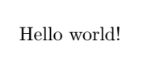
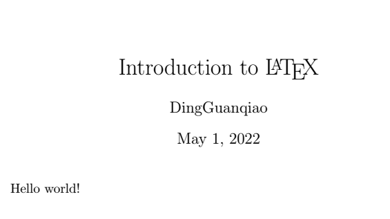
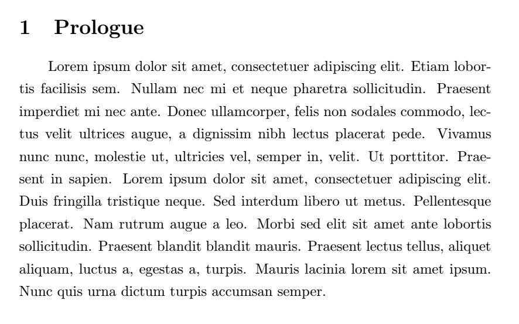

# $\LaTeX$ Introduction

## 1 Start

Basic code structure:

```latex
\documentclass[]{article}
\begin{document} %document environment where text-mode is default
Hello world!
%...
\end{document}
```

Output:



## 2 Comments

All the content in the line following symbol `%`(without a `\` preceding it)is commented and invisible in output. Refer to the example above.

## 3 Title

Between `\documentclass` and `\begin{document}` , you may format the title, like this:

``` latex
\documentclass[]{article}
\title{Introduction to \LaTeX}
\author{DingGuanqiao}
%By default the date is TODAY. Use \date{X} to replace the date with X. X may be left blank as well.
\begin{document}
\maketitle
Hello world!
\end{document}
```

Be sure to `\maketitle` in the document, or the formatted title won't appear at all.

Output:



## 4 Packages

Type a Chinese character, build, and it'll throw an error. In this case we may include a package during document preparation.

```latex
\include[UTF8]{ctex}%ctex package needed
```

## 5 Sections

Use `\section{titlename}` to make a new section with name titlename. The section will be automatically numbered.

```latex
\section{Prologue}
%sample text
```



## 6 Basic Mathematics

Use`$...$` to insert expressions in a line. `\[...\]` starts a new line. Try replacing `...` with anything you like. Or you may create an `equation` environment:

```latex
\begin{equation}
a+b=c
\end{equation}
```

In ==math-mode==, `_` means subscript for one letter and `^` means superscript for one letter. You might use braces to lengthen it.

```latex
H_2O
```

$$H_2O$$

```latex
e^{\frac{xy}{x^2+y^2}}
```

$e^{\frac{xy}{x^2+y^2}}$

## 7 Reference

https://www.latex-project.org/